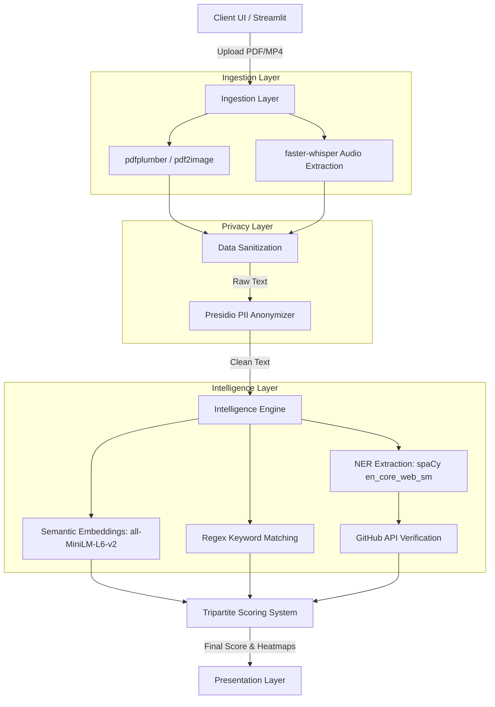

# ATS Nexus: System Architecture & Technical Specifications

**Version:** 2.1.0  
**Author:** Sajal Singhal  
**Target Audience:** Software Engineers, ML Practitioners, and System Architects.

---

## 1. Abstract
ATS Nexus is a completely localized, privacy-first, machine learning-driven Applicant Tracking System (ATS). It replaces traditional Boolean keyword-matching legacy systems with a hybrid Natural Language Processing (NLP) pipeline. It computes candidate-job alignment using dense vector semantic matching, heuristic rule-based extraction, verifiable developer history, and audio transcription.

## 2. High-Level Architecture

The system operates across three primary layers: **Ingestion**, **Intelligence**, and **Presentation**.

---

## 3. Core Component Specifications

### 3.1 Privacy & Data Sanitization Layer
To enforce unbiased screening protocols, the system implements **Microsoft Presidio** (`presidio-analyzer` & `presidio-anonymizer`).
- **Mechanism:** Before any data enters the inference graphs, Presidio runs local pattern recognition and NER models to detect Entity Types (e.g., `PERSON`, `EMAIL_ADDRESS`, `PHONE_NUMBER`, `LOCATION`).
- **Anonymization:** Found entities are physically stripped from the `bytes` stream and replaced with placeholder tags (e.g., `<PERSON>`).

### 3.2 The Tripartite Scoring Algorithm
The core output is an aggregate `Overall ATS Score` composed of three distinct weighted dimensions. This resolves the "black box" nature of typical AI screeners.

1. **Semantic Fit (50% Weight)**
   - **Model:** `sentence-transformers/all-MiniLM-L6-v2`
   - **Architecture:** 6-layer Transformer, 384-dimensional dense vectors.
   - **Operation:** Both the Job Description (JD) and Resume are chunked into logical blocks (sentences/bullets). The model generates high-dimensional embeddings for each chunk. A Cosine Similarity matrix is calculated between JD chunks and Resume chunks. The matrix collapses via `np.max(axis=1)` to find the best resume match for every required JD sentence, which is then averaged.
   - **Calibration:** The raw cosine value is pushed through a Min-Max scaler mapping the physical domain limits `[0.25, 0.75]` to `[0, 100]`.

2. **Hard Technical Skills (35% Weight)**
   - **Mechanism:** O(1) Set Intersections based on a strict `skill_catalog` matrix + dynamic heuristic n-gram extraction using NLTK/Regex constraints.
   - **GitHub Verification Engine:** If a hard skill is missing, the system utilizes the `GitHub REST API`. If the candidate's GitHub handle is detected, it crawls their public repository tags. Verified language usage (e.g., `C++`, `Python`) is dynamically injected back into the candidate's matched skill matrix, "rescuing" their score. Includes an LRU-Cache layer to respect API limits.

3. **Soft Skills & Heuristics (15% Weight)**
   - **Mechanism:** Extracted via heuristic lookup.
   - **NER Contextualization:** `spaCy` (`en_core_web_sm`) executes Name Entity Recognition to extract `DATE` and `ORG` labels.
   - **Penalty/Reward:** Resumes with dense arrays of skills but zero chronological/organizational entities are flagged as "Keyword Stuffing." Conversely, candidates exhibiting structured chronological experience receive a normalized mathematical bump (+10% soft multiplier).

### 3.3 Audio/Video Processing Pipeline
Instead of relying on cloud APIs (e.g., Google Speech-to-Text), the platform integrates **faster-whisper**.
- **Model:** `base` variant of Whisper, quantized to `int8` targeting CPU inference.
- **Workflow:** `moviepy` isolates the audio track from the `mp4` buffer. Whisper dynamically transcribes the speech to text, which is instantly routed back through the standard Text Analytics pipeline (Privacy Layer → Intelligence Layer → Tripartite Score).

---

## 4. State Management & Presentation
The front-end is rendered via **Streamlit** (v1.30+), relying heavily on `st.session_state` to prevent expensive re-inferences on UI repaints.

- **Radar Charts:** `Plotly Express` projects the Tripartite scores onto a 3-axis polar chart.
- **Bulk Vectorization:** When processing matrices of `N > 50` resumes, the Streamlit pipeline pushes results to a Pandas DataFrame and utilizes Matplotlib `imshow` to render a 2D Heatmap of standard deviation alignments between candidates.

## 5. Security & Deployment Posture
- **Zero-Cloud Inference:** With the exception of the optional GitHub crawler, 100% of the architecture executes entirely within the local bounds of the host CPU/RAM.
- **Data Retention:** `pdf_bytes` and `st.file_uploader` streams are processed entirely in ephemeral memory (`io.BytesIO`) and garbage collected natively. No resumes are written to permanent disk storage.
- **Dependency Management:** Configured exclusively under `Python 3.11` to ensure strict compatibility with `PyTorch` CPU hooks required by `transformers` and `faster-whisper`.
